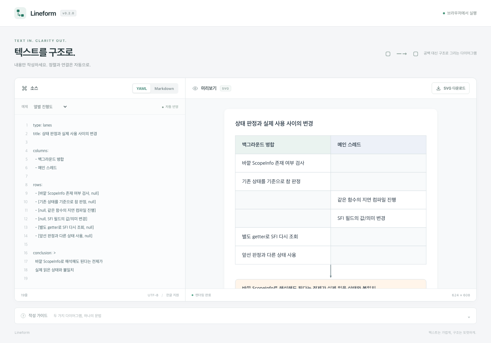

# Lineform

**Text in. Structure out.**

Version **0.2.0** · [MIT License](LICENSE)

Lineform turns structured text into clean SVG diagrams for web pages and Markdown. Write the content and relationships; Lineform measures the text, sizes the boxes, and places the connecting lines.

No space-padded borders. No manual coordinates.



## Features

- **Text-first editing** - write YAML and see the diagram update as you type.
- **Parallel timelines** - organize events into lanes with shared row boundaries.
- **Flow diagrams** - connect nodes with automatic layout, branching, and merging.
- **Markdown integration** - embed diagrams in fenced `diagram` blocks alongside regular prose.
- **Measured text layout** - wrap long labels, mixed Korean and English text, and unbroken identifiers inside their boxes.
- **Configurable box sizes** - set default and per-node widths and minimum heights, or different widths for each lane.
- **SVG export** - download diagrams with their styles and arrow definitions included.
- **Local rendering** - diagram parsing and rendering happen in your browser, without a backend API.

The current editor interface is in Korean. Diagram labels can use any language supported by your browser's fonts.

## Quick start

Requirements: Node.js 22 or later and npm. Tested with Node.js 22.2.0.

```sh
git clone https://github.com/Floodnut/lineform.git
cd lineform
npm ci
npm run dev
```

Open [http://127.0.0.1:5173](http://127.0.0.1:5173). The development server binds to the loopback interface only.

Choose an example, edit the source, and use the SVG download button to save the result. YAML and Markdown keep separate in-memory drafts; refreshing the page resets them. On narrow screens, scroll the preview horizontally to preserve the diagram's layout.

## Diagram syntax

### Parallel timeline

Use `lanes` to preserve the order of events across columns. Every row must have one cell per column; use `null` for an empty cell.

```yaml
type: lanes
title: State changes between checking and using
columns:
  - Background worker
  - Main thread
rows:
  - [Check the existing state, null]
  - [null, Update the shared state]
  - [Read the state again, null]
conclusion: The state used no longer matches the state checked.
```

`title` and `conclusion` are optional. Rows stay in the order you write them. Longer text increases the height of the entire row, keeping both columns aligned.

### Flow diagram

Use `flow` for directed graphs with branching and merging. Each node needs a unique `id` and a nonempty `label`.

```yaml
type: flow
title: Request handling
direction: down
nodes:
  - id: request
    label: Receive request
  - id: cache
    label: Check cache
  - id: origin
    label: Read source data
  - id: response
    label: Return response
edges:
  - from: request
    to: cache
  - from: request
    to: origin
  - from: cache
    to: response
  - from: origin
    to: response
```

`direction` accepts `down` (the default) or `right`. Edges must reference existing nodes. Disconnected nodes are supported; cycles, self-loops, and duplicate edges are not.

### Box sizes (0.2)

Sizes are in pixels. `width` is the total box width, including padding, and must be a finite number of at least 80. `minHeight` must be a finite, nonnegative number. Text wraps to fit the width; height grows beyond the minimum when needed, so a small `minHeight` never clips the content.

For flow diagrams, each node overrides individual fields from `defaults`:

```yaml
type: flow
defaults:
  width: 280
  minHeight: 80
nodes:
  - id: check
    label: Uses the default size
  - id: detail
    label: A wider box with extra vertical space
    width: 420
    minHeight: 120
edges:
  - from: check
    to: detail
```

For lanes, keep a column as a string or use an object with `label` and `width`:

```yaml
type: lanes
defaults:
  width: 280
  minHeight: 80
columns:
  - Background worker
  - label: Main thread
    width: 420
rows:
  - [Check the current state, null]
  - [null, Update the shared state]
conclusion: Columns can have different widths while rows stay aligned.
```

`defaults.width` applies to columns without an explicit width. `defaults.minHeight` sets the minimum body-row height; every cell in a row grows together. Headers size themselves to their text, and the conclusion spans the combined column widths with content-driven height.

Without size options, existing diagrams keep their 280px box widths and content-driven heights. The same options work inside Markdown `diagram` blocks and in exported SVGs.

### Inside Markdown

Select Markdown mode and place YAML inside a fenced `diagram` block:

````markdown
# Execution sequence

A short explanation can sit beside the diagram.

```diagram
type: lanes
columns: [Worker, Main thread]
rows:
  - [Check state, null]
  - [null, Change state]
```
````

Regular code blocks remain code. An invalid diagram shows an error in its own block without breaking the rest of the document. Each valid diagram has its own SVG download button.

Raw HTML and YAML aliases are not supported. Labels are rendered as text, not executed as HTML. External images and links in ordinary Markdown can still cause the browser to access their URLs.

## Use the renderer in a web page

The renderer can be imported directly from the source in a browser application using a bundler such as Vite. It requires a browser DOM and is not a server-side rendering API or a published npm package.

```ts
import { renderDiagram } from './src/render';

const svg = await renderDiagram(`
type: lanes
columns: [Task, Result]
rows:
  - [Validate input, Passed]
`);

document.querySelector('#diagram')!.replaceChildren(svg);
```

`renderDiagram(source)` returns a `Promise<SVGSVGElement>` and rejects invalid input with an error. SVG output uses standard elements, does not use `foreignObject`, and does not depend on the editor's CSS.

For full Markdown documents, import `renderMarkdown` from `src/markdown.ts`. It returns a `Promise<HTMLElement>`. The `.markdown-document`, `.diagram-block`, and `.diagram-scroll` styles in `src/styles.css` provide the document presentation.

## Development

Install the test browser once (macOS/Linux shell):

```sh
PLAYWRIGHT_BROWSERS_PATH=.cache/ms-playwright npx playwright install chromium --only-shell
```

Then run:

```sh
npm test
npm run build
```

| Command | Purpose |
| --- | --- |
| `npm run dev` | Start the local editor at port 5173 |
| `npm run test:unit` | Validate the YAML schema, references, and graph constraints |
| `npm run test:browser` | Test rendering and editor behavior in Chromium |
| `npm test` | Run both test suites |
| `npm run build` | Check TypeScript and build into `dist/` |
| `npm run preview` | Serve the production build locally |

The development and preview servers use the same port; stop one before starting the other.

Browser tests cover text bounds, row alignment, edge routing, multiple Markdown diagrams, invalid input, fast edits, SVG downloads, and a 390px viewport. Generated screenshots and a sample SVG are saved in the ignored `artifacts/` directory.

## Project structure

```text
src/
  model.ts      YAML parsing and diagram validation
  text.ts       Font measurement and line wrapping
  render.ts     Lane layout, ELK flow layout, and SVG generation
  markdown.ts   Markdown diagram-block rendering
  main.ts       Editor UI and rendering state
  export.ts     SVG downloads
  examples.ts   Built-in examples
  styles.css    Editor and Markdown styles
tests/          Unit and browser tests
```

## Current limitations

- No ASCII-art conversion, drag-and-drop editing, draw.io file compatibility, or persistent storage.
- Exported SVGs do not embed fonts. Opening them on another system can substitute fonts and affect text layout.
- Complex graphs may still have crossing edges.
- `direction: null` currently uses the default `down` direction rather than producing a validation error.
- The ELK layout engine loads on demand for flow diagrams. Its approximately 1.44 MB minified chunk triggers Vite's size warning; the build still succeeds.

## License

Lineform's original code is released under the [MIT License](LICENSE).

Third-party dependencies retain their own licenses, including:

- [elkjs](https://github.com/kieler/elkjs): EPL-2.0 OR GPL-3.0-or-later.
- [yaml](https://github.com/eemeli/yaml): ISC.
- [markdown-it](https://github.com/markdown-it/markdown-it): MIT.
